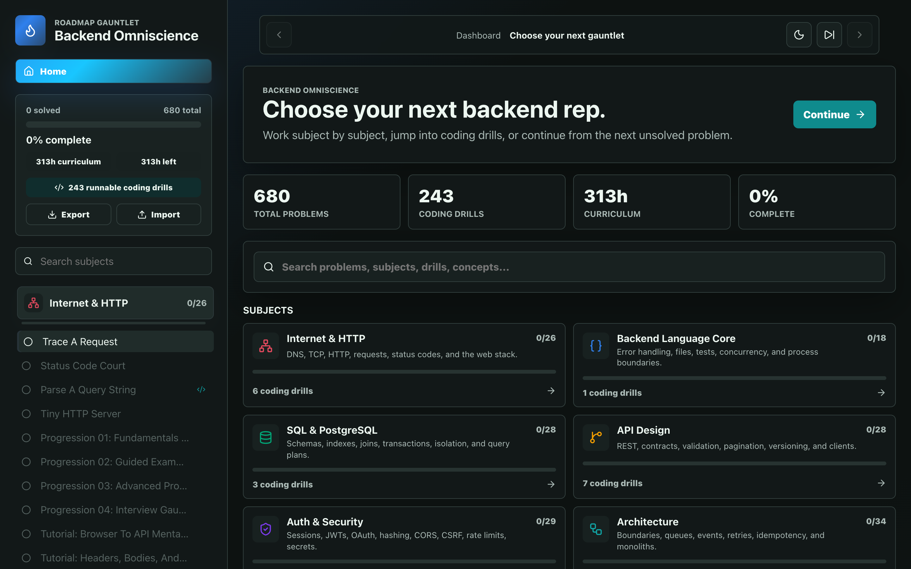

# Backend Omniscience

**0 → 1 Backend.** From your first line of code to production systems.

https://backend-omniscience.vercel.app/



A free, interactive backend curriculum. Every lesson runs the same loop: see
real code or traffic run (outputs verified against the real runtime), predict
what it does, change one thing and watch what breaks, write it yourself in an
embedded editor with real tests graded in your browser, then lock in the
takeaways. No account, no signup; progress lives in `localStorage`.

## What's inside

The catalog is two tracks plus an encyclopedia.

**Backend Concepts** — Internet & HTTP, API design, SQL & PostgreSQL, Auth &
security, Caching, Queues & background jobs, Testing & quality, Architecture,
Performance & scale, Files & object storage, DevOps, Observability, Distributed
systems, **System Design** (a 10-module concept ladder plus 23 design-interview
problems), **AWS** (an 8-module foundation course plus a 32-service flashcard
deck), and the Capstone gauntlet. Several open with a foundational, hands-on
module ladder so a true beginner starts at zero.

**Languages & Frameworks** — JavaScript, TypeScript, Node, Python, Flask,
Django, and C#/.NET, each with a from-zero interactive ladder.

**Encyclopedia** — ~140 backend terms, each its own page with a full
explanation, worked examples, and SVG diagrams, browsable by search or A-Z and
grouped into HTTP, APIs, Databases, Security, Caching & Async, Scale &
Reliability, Operations, Technologies, and Patterns.

Plus ~500 in-browser graded coding drills (Python on Pyodide, JS, TypeScript).

## Run Locally

```bash
npm install
npm run dev
```

Progress and notes are stored in browser localStorage.

Run all local checks with:

```bash
npm run check
```

The in-browser coding test specs can be self-tested with:

```bash
npm run grader:selftest
```

## Expand The Course

Add or edit subjects and problems in `src/course.ts`. The GUI updates automatically from that data.

## Curriculum Authoring Rules

- Keep every subject `id` and problem `id` unique.
- Use stable IDs; progress is keyed by problem ID in localStorage.
- Give every problem a prompt, a positive minute estimate, and at least one checklist item.
- For quizzes, include at least two `choices` and a zero-based `correctChoice`.
- Prefer small, forceful exercises over long passive lessons.

## Contributing

Contributions are welcome: new course modules, drills, glossary terms, bug
fixes, and UI improvements. Open an issue or a PR. See the Curriculum
Authoring Rules above for content conventions, and run `npm run check`
before submitting.

## License

MIT. See [LICENSE](LICENSE).

## Contributors

- **Abhi K. Tiwari** (creator)
- **Claude (Anthropic)**, AI pair programmer
